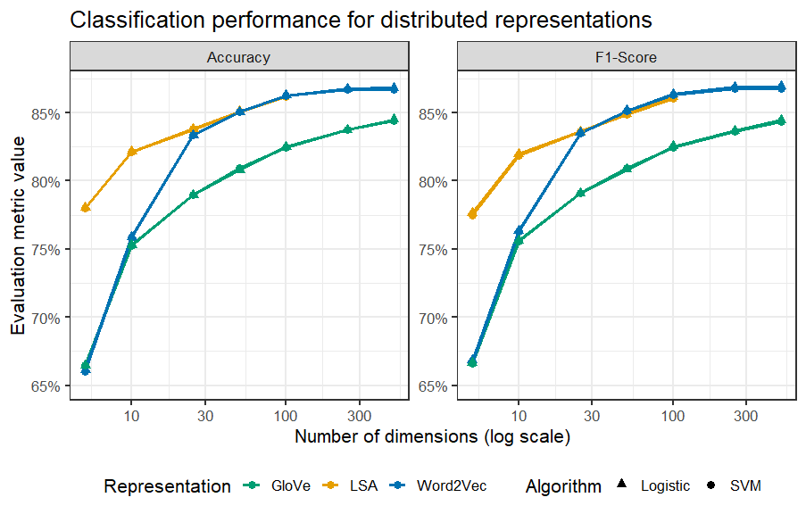
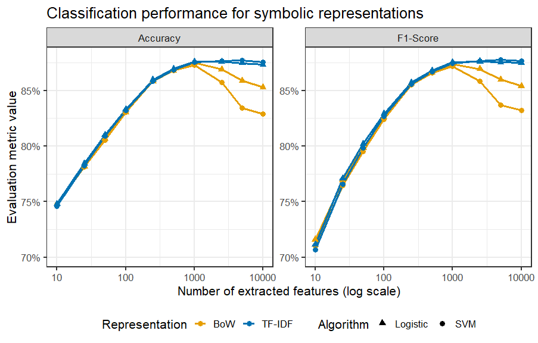

# Classification

This folder contains the R code and visualizations used to evaluate different text classification approaches applied to the IMDb Movie Reviews dataset.

The experiments are designed to compare symbolic and distributed representations, classification algorithms and effectiveness throughout various dimensions.

## 1. Methodology Overview

- **Representations**:
  - Symbolic: Bag-of-Words (BoW), TF-IDF, with $\chi^2$ feature extraction
  - Distributed: LSA, Word2Vec, GloVe

- **Classification algorithms**: To estimate the cost regularization parameter, 10-fold cross validation is used.
  - SVM
  - Logistic regression

## 2. Results

To evaluate the performance of the classification experiments, the metrics Accuracy and F1-Score are employed.

The results are represented in graphs where the X-axis represents the number of dimensions used in log scale, and the Y-axis the respective evaluation score.

### 2.1 – Distributed Representations (LSA, Word2Vec, GloVe)

### 2.2 – Symbolic Representations (BoW and TF-IDF)

