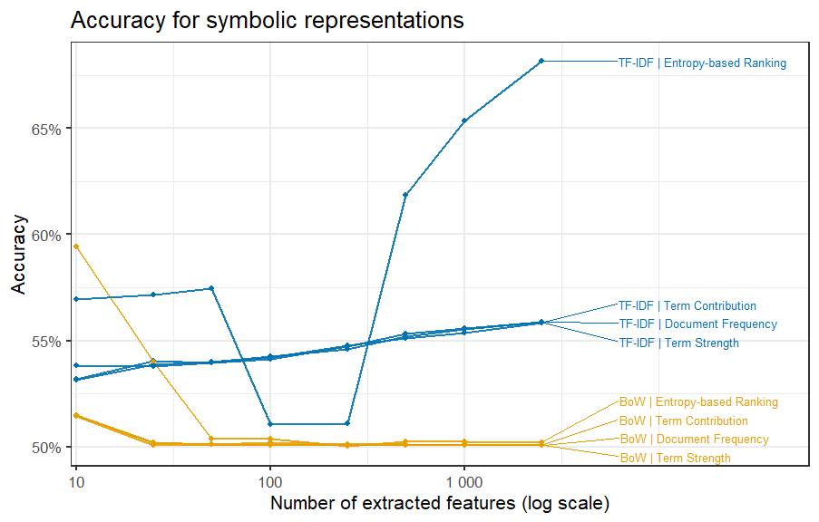
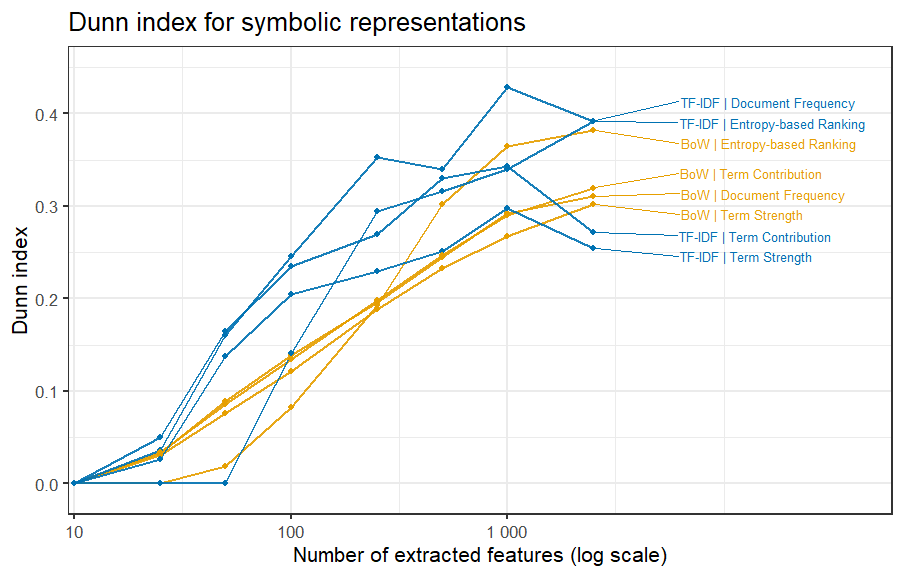
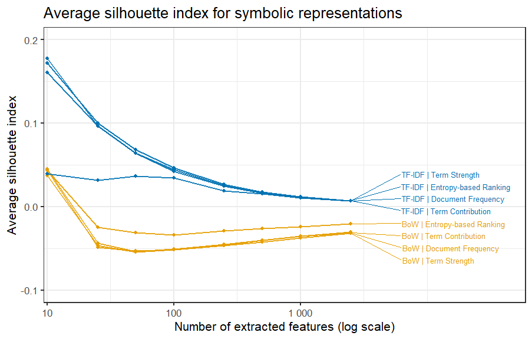

# Clustering

This folder contains the R code and visualizations used to evaluate different clustering approaches applied to the IMDb Movie Reviews dataset (25.000 reviews from test subset).

The clustering experiments are designed to compare symbolic and distributed representations, feature extraction methods and effectiveness throughout various dimensions.

## 1. Methodology Overview

The kmeans clustering algorithm is used, in combination with all the following methods:

- **Representations**:
  - Symbolic: Bag-of-Words (BoW), TF-IDF
  - Distributed: LSA, Word2Vec, GloVe

- **Feature Extraction Methods** (for symbolic representations):
  - Document Frequency (DF)
  - Term Strength (TS)
  - Term Contribution (TC)
  - Entropy-Based Ranking (EBR)

## 2. Results

To evaluate the performance of the clustering experiments, external and internal validation metrics are used: Accuracy, Dunn index, and average silhouette index.

The results are represented in graphs where the X-axis represents the number of dimensions used in log scale, and the Y-axis the respective evaluation score.

### 2.1 – Distributed Representations (LSA, Word2Vec, GloVe)

### 2.2 – Symbolic Representations (BoW and TF-IDF)

Graph with all of the evaluation metrics combined:

Individual graphs for every metric:

