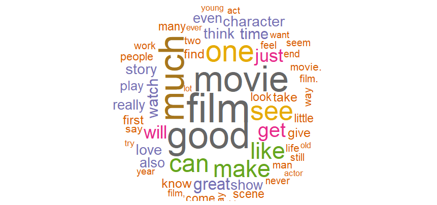

# Visualization

This directory contains the code and resulting visualizations generated from the IMDb Movie Reviews dataset. The visualizations help to understand the textual data distribution and relationships among terms.

## Visualizations included:

### 1. Word Clouds
- **Positive Reviews Word Cloud**  
  

- **Negative Reviews Word Cloud**  
  

### 2. Co-occurrence Networks
- **Positive Reviews Term Co-occurrence Network**  
  

- **Negative Reviews Term Co-occurrence Network**  
  

### 3. Review Length Distribution
  

---